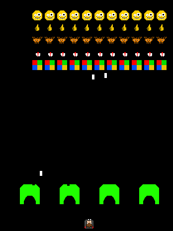

# RInvaders | A Space Invaders Clone
Space invaders made with RGFW and software rendering. Featuring the beloved mascot Lonic and a few other CS mascots... 

# goals 
A major goal for this project is to make a game handled in a 'simple' way. There is no game state. All the game 'knows' about is where it's information about the player and the barrels. 

1) Collision is handled by checking if a sprite draw replaced another color.
2) All sprite are stored as static bitmap arrays.
3) The map is a bitmap that is created at startup.
